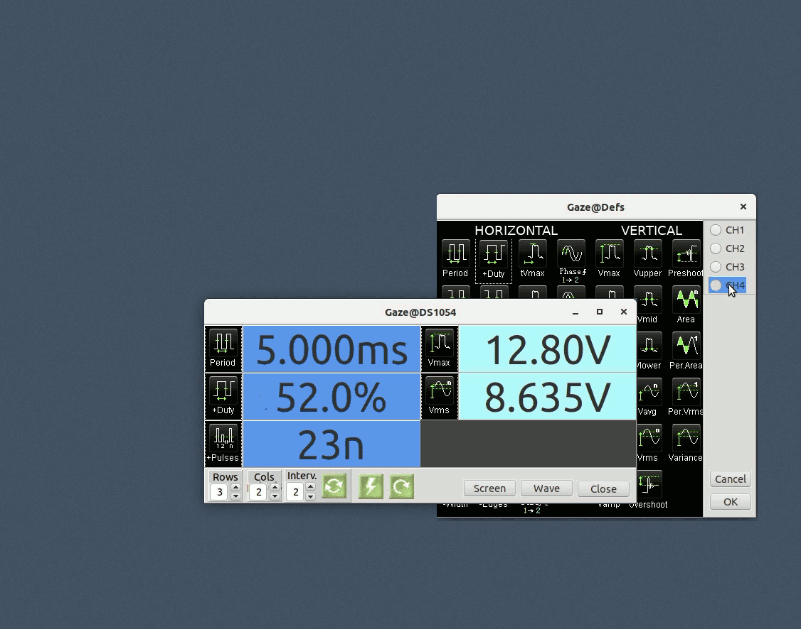
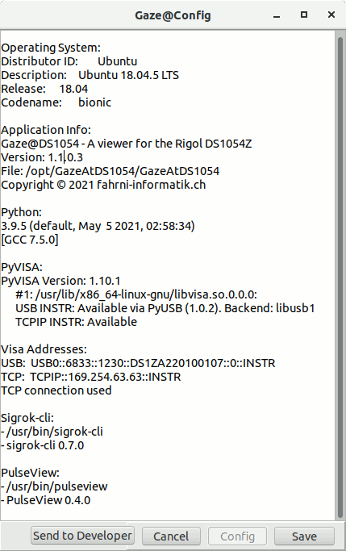

# GazeAtDS1054 - a RIGOL DS1054Z viewer

Gazing at my scope and trying to read the numbers on the display, made me write this little program which was supposed to display the data nice and big on my PC screen. The project turned out to be fun and thus got out of hand a little. Have a look at what it does and if you find it could be useful to you, be welcome to download and use it:

- free of charge (see license )
- free of guarantee (see the license)
- free of support (also see the license)


## What does it do

GazAtDS1054 captures data from the RIGOL DS1054Z scope and:

- displays selected measurements in a definable grid form
- displays and exports screen-shots from the scope display
- displays and exports wave forms and FFTs




## What is it made of

This application runs on Ubuntu and is written in FPC-Lazarus and calls P4D components to access the scope using Python/PyVisa.

It is tested with the following 64bit versions of Ubuntu and Python:

- ubuntu-18.04.5-desktop-amd64
- ubuntu-20.04.2.0-desktop-amd64
- ubuntu-20.04.2.0-desktop-amd64 (live from USB)
- debian-live-10.9.0-amd64-gnome+nonfree (manual install / quick test)
- python 3.6
- python 3.8
- python 3.9

You might be lucky with other flavors of Ubuntu using Python3 or Python4. 


## Install it

In this Documentation it is assumed, that a single Python3 version is installed and used. Thus all commands referencing to Python, "python3" is used. If more than one python version is installed, make sure you are referring to a specific version by using the minor version in commands (e.g. "python3.9" or "python4.2" etc)

If a working version of PyVisa is already  installed on your system,  you want to Check the connection to the scope first (see below). If this is successful, it might be better to just unzip the application files instead of installing yet another version of PyVisa.

If you use Python3 on an Ubuntu installation, GazeAtDS1054 can be installed from the deb package. Make sure you have Universe Repository enabled before  updating your system. Then run those commands from the terminal:

```
$ sudo apt update
$ sudo apt install <file-location>/gazeatds1054_x.x.x-x_amd64.deb
$ # Please reboot the system now.
```

Find more install options in section More... below.


## Run it

Run GazeAtDS1054 

- from the Ubuntu launcher or 

- from Run Command Dialog `ALT+F2` type:
  
  ```
  /opt/GazeAtDS1054/GazeAtDS1054
  ```

There is no extensive Help system coming with GazeAtDS1054 nor is there a Users Guide. Try it and you should get what you click and hope for. Hovering over a button might give you a Hint  or typing `F1` might display a short HELP for you.

#### Configuration

The first time GazeAtDS1054 is run, a configuration dialog is displayed.



You will be asked to confirm/modify

- the Python library to be used.
  You can find your Python versions on the terminal:
  
  ```
  $ python3 --version   #or python4 --version
  Python 3.6.9
  $ ls -l /usr/lib/x86_64-linux-gnu/libpython3.6*.so* | sed 's/.*\/usr/\/usr/'
  /usr/lib/x86_64-linux-gnu/libpython3.6m.so -> libpython3.6m.so.1
  /usr/lib/x86_64-linux-gnu/libpython3.6m.so.1 -> libpython3.6m.so.1.0
  /usr/lib/x86_64-linux-gnu/libpython3.6m.so.1.0
  ```
  
- the USB/LAN Visa addresses for the scope
  If a USB connection is available, the addresses are automatically filled in
  Else you have to type in the addresses manually the LAN Visa Address being available from the IO.Settings of the scope and the USB Visa Address usually being  'USB0::6833::1230::DS1ZA220100107::0::INSTR'
  
- The connection Type USB or TCP you wish to use. 
  This can be changed later using the Run option `--change-input-type`.
  Note: If TCP is used, the USB cable has to be removed.

#### Run options

You can open the configuration dialog using the Run Command Dialog `ALT+F2` and type:

```
$ /opt/GazeAtDS1054/GazeAtDS1054 --reset
```

You may change (toggle) the connection type USB/LAN using the Run Command Dialog `ALT+F2` and type:

```
$ /opt/GazeAtDS1054/GazeAtDS1054 --change-input-type
```

The installation log can be displayed. Start the Run Command Dialog `ALT+F2` and type:

```
$ /opt/GazeAtDS1054/GazeAtDS1054 --info
```


## More ...

#### Manual Installation

If, for some reason - perhaps you want to use Python4 - you want to  install GazeAtDS1054 manually, all application files are available in gazeatds1054_x.x.x-x_amd64.zip and the following terminal commands might get you there:

```
$ sudo apt update
$ # if Ubuntu do the following:
$ sudo apt install python3-pip
$ python3 -m pip install pyvisa
$ python3 -m pip install pyvisa-py
$ python3 -m pip install pyusb
$ # else if Debian
$ sudo apt install python3-pyvisa-py
$ sudo apt install python3-usb
$ # fi
$ sudo unzip <PathToZip>gazeatds1054_x.x.x-x_amd64.zip -d /
$ sudo groupadd usbusers
$ sudo usermod -aG usbusers $USER
$ sudo usermod -aG dialout $USER
$ mkdir /home/$USER/.config/GazeAtDS1054
$ chmod 755 /home/$USER/.config/GazeAtDS1054
$ # Reboot the system now.
```

#### Additional Users

If GazeAtDS1054 should be used by other users on the system, the local environment for every user must be set up as follows:

```
$ python3 -m pip install pyvisa
$ python3 -m pip install pyvisa-py
$ python3 -m pip install pyusb
$ sudo usermod -aG usbusers $USER
$ sudo usermod -aG dialout $USER
$ mkdir /home/$USER/.config/GazeAtDS1054
$ chmod 755 /home/$USER/.config/GazeAtDS1054
```

#### Remove Installation

```
$ sudo deluser $USER usbusers
$ # delete all files listed by zipinfo
$ zipinfo -1 <DirToZip>/gazeatds1054_x.x.x-x_amd64.zip 
$ rm -R /home/$USER/.config/GazeAtDS1054
$ sudo deluser $USER usbusers
$ # if pyvisa is not used anywhere else, remove it
$ python3 -m pip uninstall pyusb
$ python3 -m pip uninstall pyvisa-py
$ python3 -m pip uninstall pyvisa
$ sudo apt remove python3-pip
```


## It does not work!

Be warned: As you probably know, finding out why an installation doesn't work can be a tedious undertaking, especially with different software versions installed. So, if you are not a nerd or a pensioner with unlimited time at hand, it might be wise to consider other possibilities like squinting your eyes again while gazing at your scope.

However, before giving up, you might want to try the following:

#### Check the application installation log

If you actually got GazeAt1054 up and running, the installation log can be displayed. Start the Run Command Dialog `ALT+F2` and type:

```
$ /opt/GazeAtDS1054/GazeAtDS1054 --info
```

#### Check your installation

You can do some basic checks on your pyvisa installation:

- you should have a Python version >3.2 installed.
- make sure you got the 64bit Ubuntu and Python versions software
- the backends for USB INSTR and TCPIP INSTR must be available

```
$ python3 -m visa info
Machine Details:
   Platform ID:    Linux-5.8.0-50-generic-x86_64-with-glibc2.29
   **Processor:      x86_64**

Python:
   Implementation: CPython
   Executable:     /usr/bin/python3
   **Version:        3.8.5**
   Compiler:       GCC 9.3.0
   **Bits:           64bit**
   Build:          Jan 27 2021 15:41:15 (#default)
   Unicode:        UCS4

PyVISA Version: 1.11.3

Backends:
   ivi:
      Version: 1.11.3 (bundled with PyVISA)
      Binary library: Not found
   py:
      Version: 0.5.2
      ASRL INSTR:
         Please install PySerial (>=3.0) to use this resource type.
         No module named 'serial'
      **USB INSTR: Available via PyUSB (1.1.1). Backend: libusb1**
      USB RAW: Available via PyUSB (1.1.1). Backend: libusb1
      **TCPIP INSTR: Available** 
      TCPIP SOCKET: Available 
      GPIB INSTR:
         Please install ...
```

#### Check the connection to the scope

Running Python in a Terminal, you should be able to connect to your scope.
Note: Disconnect USB cable it you are using the Ethernet connection.

```
$ python3
>>> import pyvisa
>>> rm=pyvisa.ResourceManager("@py")
>>> print(rm.list_resources())
('USB0::6833::1230::DS1ZA220100107::0::INSTR',)
>>> scope=rm.open_resource('USB0::6833::1230::DS1ZA220100107::0::INSTR')
>>> scope.query("*IDN?")
RIGOL TECHNOLOGIES,DS1054Z,DS1ZA220100107,00.04.04.SP4\n
>>>
```

